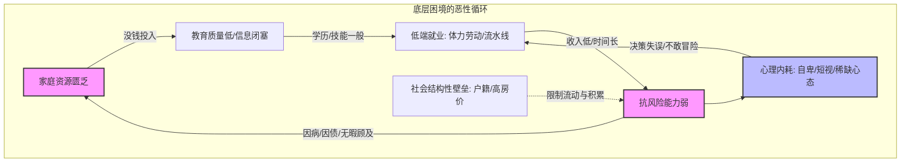
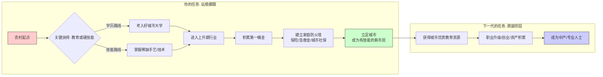
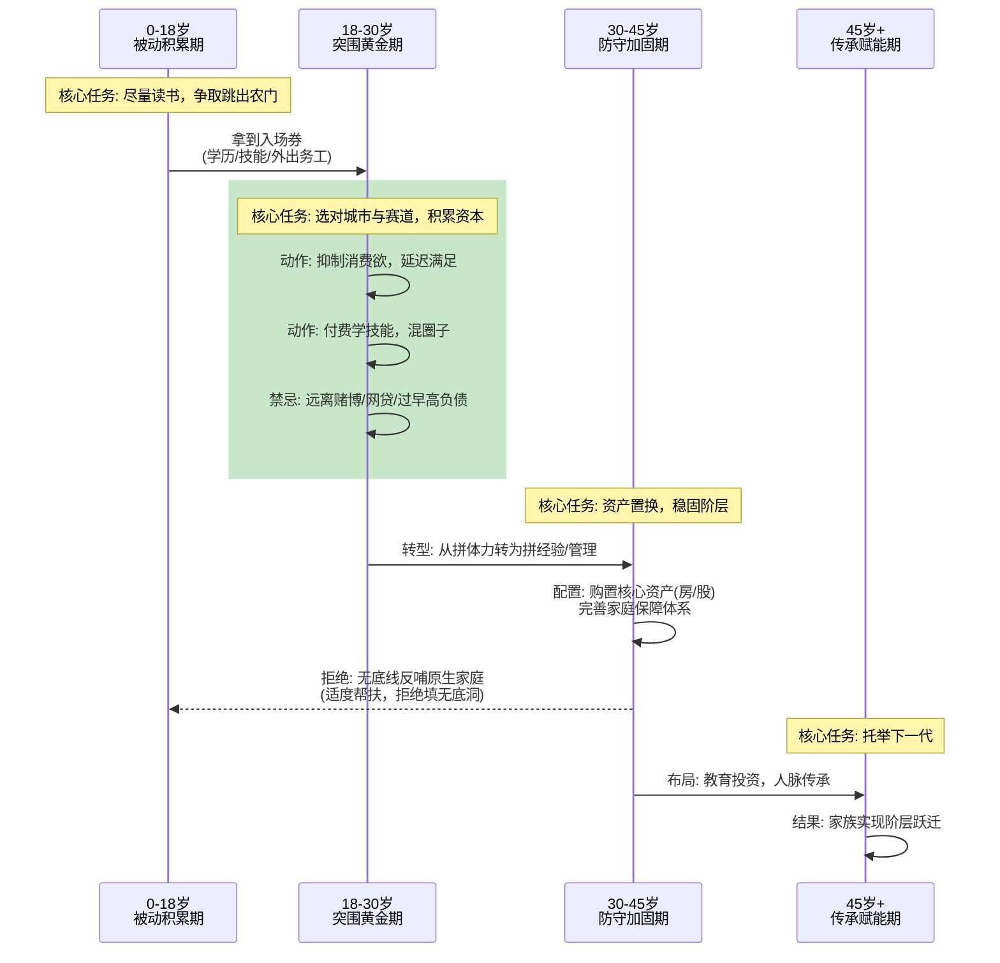

这是一个非常宏大且沉重的话题。底层农村子女面临的不仅是“缺钱”，更是一套**系统性的困境闭环**。
为了让你一眼看透本质，我将用三张图来拆解：**困境模型（为什么难）、破局路径（怎么走）、时序策略（每一步做什么）**。
---
### 一、 困境模型图：为什么这代人依然难翻身？
这不仅仅是“没钱”的问题，而是**资源、认知、环境**的三重围困。

**核心痛点解析：**
1.  **资源陷阱**：不仅缺钱，更缺“信息差”（不知道哪些行业有前途）和“试错成本”（一次失败就毁掉全家）。
2.  **稀缺心态**：长期贫穷导致人只关注眼前生存（稀缺），忽视长期规划（如教育投资、健康投资），这是大脑机制决定的。
3.  **抗风险弱**：一场大病就能击穿一个农村家庭几十年的积累，导致返贫。
---
### 二、 破局路径图：三代人的接力赛
摆脱命运通常不是一代人的事，而是一场接力赛。第一代人的核心任务是**“断穷根”**（建立安全防线），而不是一步登天。

**破局关键点：**
1.  **跳出“低水平勤奋”**：不要只顾着埋头干活，要抬头看路。从“出卖体力”转向“出卖技能/经验”。
2.  **地理套利**：去资源密集的大城市。大城市虽然生活成本高，但相对公平，机会密度大，是阶层流动的唯一窗口。
3.  **建立防火墙**：在给家里盖房之前，先给自己买保险、存备用金。**防止因病返贫**是底层子女的第一要务。
---
### 三、 时序策略图：人生阶段的“打法”
人生不同阶段，重心不同。底层子女最大的坑就是：**在错误的阶段做了错误的事**（比如年轻时过度消费、中年时才想起学技能）。

**时序避坑指南：**
1.  **18-25岁（最危险期）**：
    *   **陷阱**：刚接触社会，容易被消费主义洗脑（买手机、车、游戏），或者被家里催婚、要钱盖房。
    *   **策略**：极度抠门，把钱花在“刀刃”上（考证、学技术、买生产工具）。不要为了面子在老家盖空置的楼房，要在工作地买房或投资自己。
2.  **25-35岁（定基调期）**：
    *   **陷阱**：温水煮青蛙，在一个没前途的岗位上混日子，或者因为不仅没有积累还背上高利贷。
    *   **策略**：寻找“复利”工作。哪怕送外卖，也要想着怎么攒钱买车、怎么跑单最多、怎么以后做站点代理。必须完成从“纯体力”到“半技术/管理”的转型。
3.  **关于原生家庭（贯穿始终）**：
    *   底层家庭往往是“溺水者”，会下意识抓住每一个浮木（包括你）。
    *   **正确姿势**：你要做岸上的救生员，而不是水里的浮木。只有你自己先上岸、站稳了，才能扔绳子救人。**不要为了满足父母的虚荣心（如老家盖房、亲戚借钱）而牺牲自己的未来。**
### 总结一句话
底层农村子女破局，本质上是一场**“反人性的修行”**：
你需要克服基因里的短视，对抗环境的噪音，在极度匮乏的资源中，通过**读书/学艺 -> 进城 -> 积累 -> 防守**的枯燥循环，用一代人的忍耐，换下一代人的起点。
