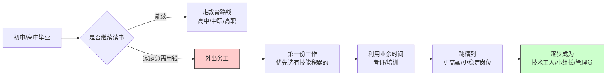
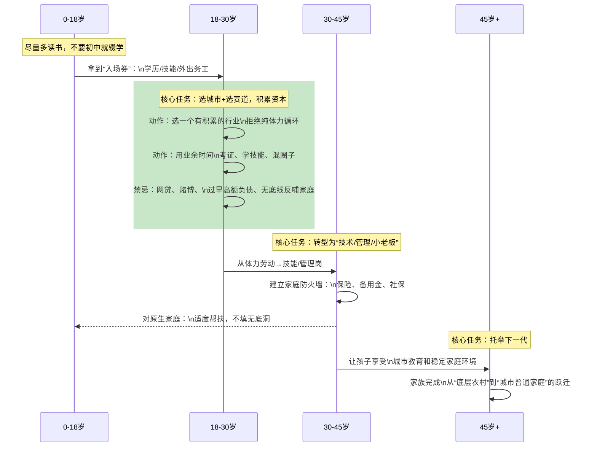

先给一个整体结论，再给你“可执行”的路径和图表。
---
## 一、底层农村子女的典型困境（一张结构图）

关键点：  
不是“不够努力”，而是**缺资源 + 缺信息 + 缺试错成本**，形成一个闭环。
---
## 二、常见可执行途径一览（总表）
先给你一个“菜单”，再展开讲怎么选、怎么做。
| 路径 | 适合谁 | 大概回报周期 | 难度 | 举例方向 |
|------|--------|--------------|------|----------|
| 1. 普通高考 → 本科 | 成绩中上、能坚持啃书 | 5–10年 | 中高 | 985/211、一本、二本，选“高回报专业” |
| 2. 中职/高职 → 技术就业 | 不想/不适合纯理论，动手能力强 | 3–7年 | 中 | 机械、汽修、护理、计算机、电商运营等 |
| 3. 农村专项计划、定向培养 | 成绩不错、想降低竞争 | 5–10年 | 中 | 国家专项、地方专项、公费师范、定向医学生等 |
| 4. 进城务工 + 技能培训 | 已辍学或家庭急需用钱 | 3–10年 | 中 | 建筑、制造、快递、外卖、服务业 + 技能考证 |
| 5. 返乡创业 / 现代农业 | 有家乡资源、有项目头脑 | 3–10年 | 高 | 农产品电商、特色种养殖、乡村旅游等 |
| 6. 参军 → 提干/考学 | 身体条件好、纪律性强 | 5–10年 | 中高 | 士兵考军校、提干、转业安置等 |
下面重点讲“普通人最可能走得通”的几条。
---
## 三、教育路线：普通高考 / 职业教育，怎么选更“值”
### 1. 普通高考：仍然是回报最高的一条路
- 中国大学平均教育回报率约 **10%**，本科回报率可到 **16% 左右**，而高中阶段回报率只有 **4.5% 左右甚至接近 0**。  
- 对农村孩子来说，**考上本科，尤其是好城市的本科，是改命效率最高的通道之一**。
**可执行做法：**
1. **目标院校：**  
   - 有潜力冲一本，就全力冲一本；  
   - 冲不到，优先选：**省会 / 经济发达城市的二本或高职院校**（实习机会多，信息多）。
2. **专业选择原则（结合家庭无背景的现实）：**  
   - 保下限：师范、医学、护理、会计、审计、工程等“有一技之长”的专业；  
   - 拼上限：计算机、数据类、新能源、智能制造等，行业需求大、收入天花板高。
3. **利用好农村专项计划：**  
   - 国家专项、地方专项计划，对农村户籍考生有降分或单独批次，增加进入好学校的机会。
---
### 2. 职业教育（中职/高职）：对很多农村家庭，更现实的“技术翻身路”
研究发现：  
- 农村职业教育对个人收入的年均回报率可达 **10%+**，显著高于普通高中。  
- 接受中等职业教育，对农村个体收入的正向贡献尤其明显。
**可执行做法：**
1. **如果初中成绩一般，不要死磕普高：**  
   - 选一所**靠谱的中职/高职**，重点看：  
     - 学校的就业率、校企合作；  
     - 专业是否对接当地产业（比如机械、汽修、计算机、护理、电商等）。
2. **专业选择建议：**  
   - 男孩：机械加工、机电一体化、汽车维修、工业机器人、电工电子等；  
   - 女孩：护理、康复技术、学前教育、会计、电商运营等。
3. **升学路径：中职≠终点：**  
   - 通过“职教高考”“3+2”“单招”等，一样可以升入大专，甚至专升本。  
   - 很多地区，中职生可通过技能大赛免试升入高职或本科。
---
## 四、进城务工 + 技能提升：最现实的“起步路线”
大量农村青年是通过“外出务工 + 技能培训”慢慢在城市站稳脚跟的。  
研究发现：农村外出务工青年普遍存在**工资偏低、强度大、职业不稳定、社保不足**等问题，关键突破口是：**职业技能水平 + 就业渠道 + 政策监督**。
### 可执行步骤（按时间线）

**具体建议：**
1. **第一份工作，尽量选“能学东西”的：**  
   - 尽量避开：纯普工、纯体力、无技术积累的流水线；  
   - 更优选择：  
     - 建筑/装修（木工、电工、焊工）；  
     - 制造业（数控机床、设备维修）；  
     - 物流/快递（仓储管理、调度）；  
     - 服务业（厨师、烘焙、汽修、理发等）。
2. **“边干边学”，一定要搞一两本证：**  
   - 电工证、焊工证、钳工证、驾驶证、计算机证书、会计证等；  
   - 很多城市对外来务工人员有免费或补贴培训，注意人社局、工会、妇联的通知。
3. **每 3–5 年给自己做一次“职业升级”：**  
   - 从普工 → 技术工 → 带班/组长 → 转管理或更高技术岗位；  
   - 不要在同一家厂里，干 10 年同样的活，只涨工龄，不涨能力。
---
## 五、返乡创业 / 现代农业：适合少数有项目头脑的人
不是所有人都适合创业，但对有家乡资源、有经营头脑的农村子女，是一条值得考虑的路。
**可执行前提：**
- 先在城市打几年工，积累：  
  - 第一桶金（启动资金）；  
  - 行业经验；  
  - 市场意识和人脉。
**适合方向：**
- 农产品电商（直播带货、社群团购）；  
- 特色种植/养殖（结合当地气候和品牌）；  
- 农业服务：无人机植保、农机服务、农业技术托管等。
**风险控制：**
- 从小规模试错开始，不要一开始就借钱、盖大场房；  
- 多利用政府补贴、创业贷款、乡村振兴项目。
---
## 六、把“人生路径”画成时序图（0–45岁，每阶段该做什么）

---
## 七、最关键的一点：改变“信息差”和“决策习惯”
底层农村子女最大的劣势，不是智商，而是：
1. **信息差**：不知道有哪些路、哪些政策、哪些行业。  
2. **决策习惯**：只看眼前，不计算长期收益。
**你可以立刻做的 3 件事：**
1. **每天固定 30 分钟看“有用的信息”：**  
   - 不刷短视频，改看：行业公众号、政府公告、招聘网站、技能培训信息。  
2. **找一个“城市里的前辈”做榜样：**  
   - 可以是亲戚、老乡、网友，看看他们是怎么一步步走过来的。  
3. **给自己写一份 5 年规划：**  
   - 写下来：5 年后想达到的收入、岗位、生活状态，再倒推每一年要做什么。
---
如果你愿意，可以告诉我：  
- 你现在年龄、学历、是否在读、有没有辍学打工；  
我可以按你的具体情况，帮你选一条最合适的“主路径”，再拆成 3–5 年的具体行动清单。
